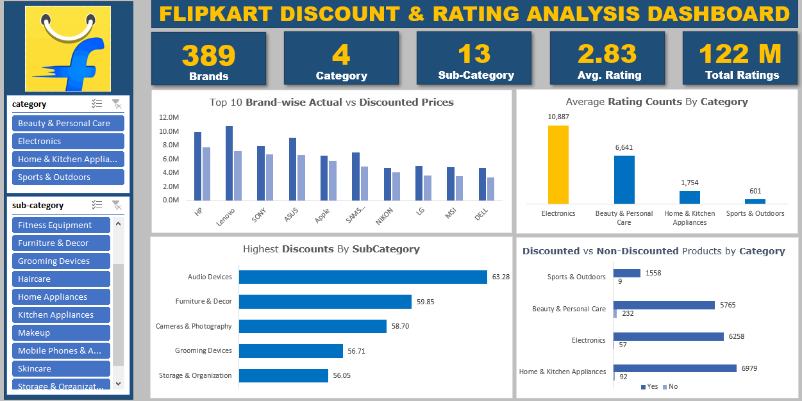

# Flipkart-Discount-And-Rating-Analysis-Using-Excel

## Problem Statement
With thousands of products listed on Flipkart, understanding the effectiveness of discount strategies and customer ratings is essential to remain competitive in the e-commerce industry. This project aims to uncover trends and patterns in product pricing, discounts, and customer feedback to enhance decision-making.

## Goal
To analyze Flipkart's product data to derive actionable insights on:
- Discount strategies and their effectiveness across categories.
- Top-performing brands and sub-categories in terms of customer ratings.
- Customer preferences as reflected by ratings distribution.

## Stakeholders
- **E-commerce Managers**: To evaluate pricing and promotional strategies.
- **Category Specialists**: To focus on high-potential products and sub-categories.
- **Marketing Teams**: To design campaigns targeting low-performing categories or sub-categories.
- **Product Teams**: To improve customer experience by analyzing low-rated products.

## Tools/Skills Used
- **Web Scraping**: Automated data extraction from Flipkart’s platform.
- **Power Query Editor**: Data cleaning and transformation.
- **Excel**: Data integration, cleaning, and dashboard creation with interactive slicers.
- **Visualization Skills**: Charts, metrics, and slicers to enhance dashboard usability.

## Insights
1. **Top Metrics**:
   - Total Brands: 389.
   - Categories: 4, with 13 sub-categories analyzed.
   - Average Rating: 2.83, derived from a dataset with 122 million ratings.

2. **Top Brands Actual vs Discounted Prices**:
   - HP, Lenovo, Sony, ASUS, and Apple are among the top brands with significant variations between actual and discounted prices, indicating strategic discounting practices to attract buyers.

3. **Sub-category Discount Insights**:
   - **Audio Devices (63.28%)** and **Furniture & Décor (59.85%)** enjoy the highest average discounts, showing aggressive promotions in these areas.

4. **Average Number of Ratings by Category**:
   - Electronics has the highest average number of ratings (10,887), followed by Beauty & Personal Care (6,641).
   - Sports & Outdoors has the lowest average number of ratings (601), suggesting limited customer engagement or fewer reviews in this category.

5. **Discounted vs Non-Discounted Products**:
   - Home & Kitchen Appliances have the largest share of discounted products (6,979), while Sports & Outdoors feature significantly fewer discounted items.

## Dashboard
Below is the visual representation of the analysis:

## Conclusion
This project highlights the importance of integrating discount strategies with customer ratings to optimize sales and customer satisfaction. The analysis provides Flipkart with actionable insights to fine-tune its discounting and category-specific marketing strategies for maximum impact.
